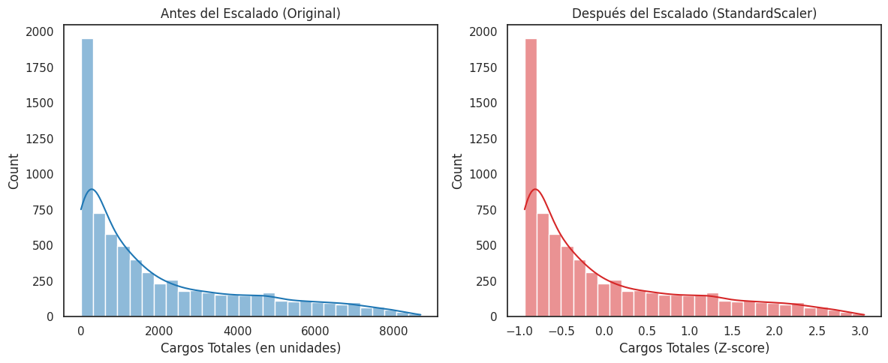
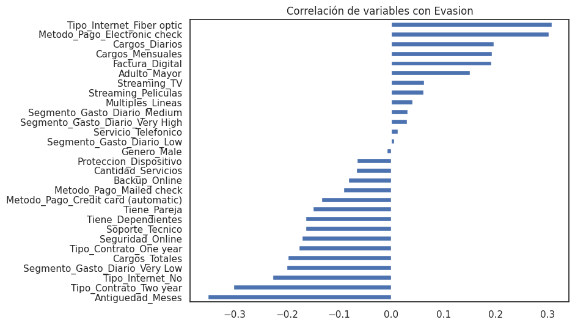
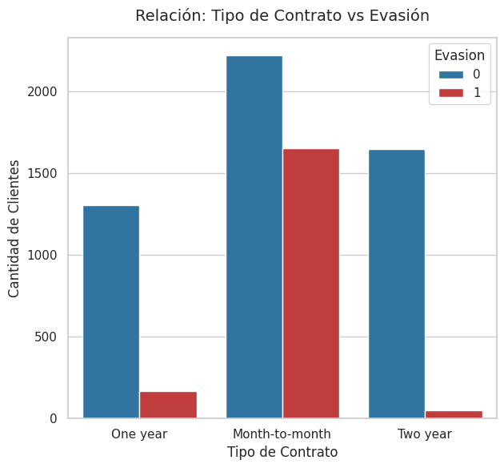
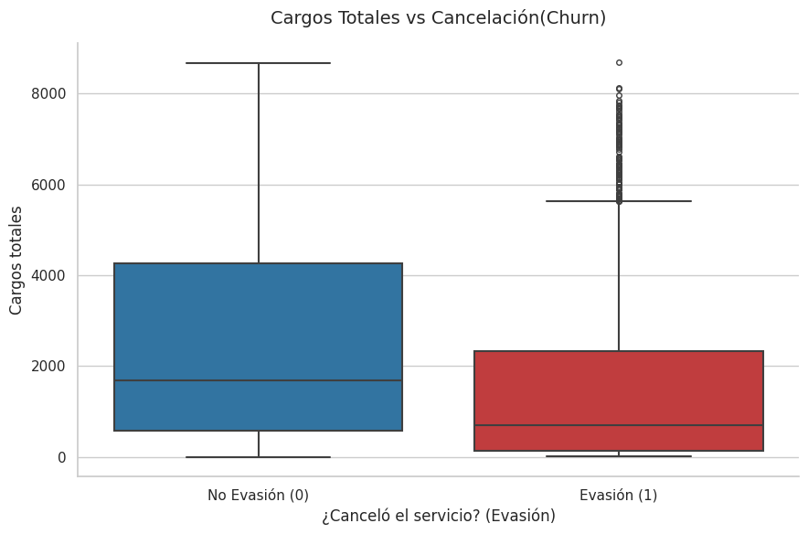
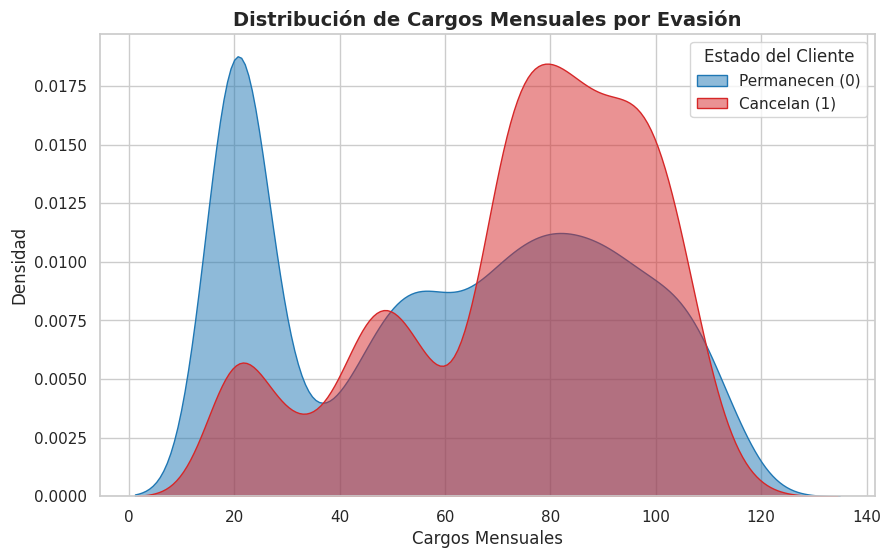
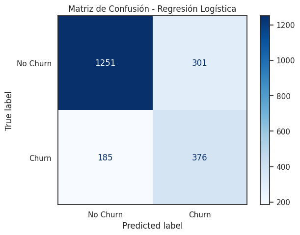
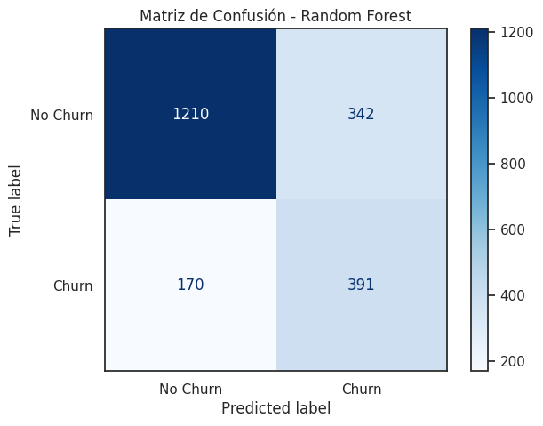

# 📞 Telecom X: Predicción de Churn (Parte 2)

Proyecto de Machine Learning orientado a la predicción de cancelación de clientes (Churn) en una empresa de telecomunicaciones.

El análisis transforma datos históricos en una herramienta estratégica capaz de identificar clientes con alto riesgo de evasión y apoyar decisiones de retención basadas en datos.

## 🎯 Objetivo del Proyecto

Desarrollar modelos de clasificación que permitan predecir si un cliente cancelará su servicio:

Evasion = 1 → Cliente cancela

Evasion = 0 → Cliente permanece

Dado el contexto de negocio, se prioriza el Recall, ya que es más crítico detectar la mayor cantidad posible de clientes que podrían abandonar el servicio, incluso si esto implica aceptar algunos falsos positivos.

---

📁 **Estructura del Proyecto**

```
Telecom-X-Parte-2/
│
├── TelecomX_LATAM_parte_2.ipynb      # Notebook principal (EDA + Modelado)
├── data/
│   └── datos_tratados.csv            # Dataset limpio y preprocesado
├── visualizaciones/                  # Gráficos generados durante el análisis
└── README.md                         # Documentación del proyecto
```

---

## 🛠️ Preparación de los Datos

El proceso de preparación incluyó las siguientes etapas:

1️⃣ **Clasificación de Variables:**

- **Numéricas:**
  - Antiguedad_Meses
  - Cargos_Mensuales
  - Cargos_Totales
    
- **Categóricas:**
  - Tipo_Contrato
  - Tipo_Internet
  - Metodo_Pago
  - Servicios adicionales (Soporte, Streaming, Seguridad, etc.
---
   
2️⃣ **Codificación (Encoding):**

Las variables categóricas fueron transformadas mediante:
- **One-Hot Encoding** (para variables nominales)
- **Label Encoding** (cuando fue necesario)

Esto permitió que los algoritmos trabajaran correctamente con datos numéricos.

---

3️⃣ **Estandarización**

Se aplicó StandardScaler a las variables numéricas en modelos sensibles a la escala, como la Regresión Logística.

   

La estandarización evita que variables con mayor magnitud dominen el modelo.

---

4️⃣ **División de Datos**

El dataset fue dividido en:

- **70% Entrenamiento**

- **30% Prueba**

Utilizando:

```
train_test_split(..., stratify=y)
```

La estratificación garantizó que la proporción de clases se mantuviera constante en ambos conjuntos, lo cual es fundamental debido al desbalance detectado en la variable objetivo.

---
## 📊 Análisis Exploratorio de Datos (EDA)

El EDA permitió identificar patrones clave relacionados con la cancelación.

Los siguientes análisis visuales evidencian las principales variables asociadas al churn:

### 🔎 **Análisis de Correlación**



Se analizó la correlación entre las variables y la variable objetivo Evasión. Las variables con mayor correlación positiva fueron Tipo_Internet_Fiber optic (0.30) y Metodo_Pago_Electronic check (0.30), lo que indica que los clientes con estos atributos presentan mayor probabilidad de cancelación.

Por otro lado, las correlaciones negativas más fuertes corresponden a Antiguedad_Meses (-0.35) y Tipo_Contrato_Two year (-0.30), lo que sugiere que la permanencia y los contratos de largo plazo reducen significativamente el riesgo de churn.

**Insight:**
La cancelación está fuertemente influenciada por factores contractuales y por el tiempo de permanencia del cliente. Asimismo, ciertos segmentos de servicio y métodos de pago presentan mayor propensión al abandono, lo que abre oportunidades para estrategias de retención segmentadas.

### 🔎 **Tipo de Contrato vs Cancelación**

 

Los clientes con contrato mensual presentan la mayor proporción de cancelación, mientras que los contratos anuales y bianuales muestran tasas considerablemente menores.

**Insight:**
El nivel de compromiso contractual actúa como un mecanismo natural de retención. Los clientes con contratos de mayor duración tienen menor probabilidad de churn, lo que sugiere que incentivar la migración a planes anuales puede reducir significativamente la evasión.

---

### 🔎 **Antigüedad del Cliente**

 

Los clientes con menor antigüedad tienden a cancelar con mayor frecuencia.

**Insight:**
El riesgo de evasión es mayor en las primeras etapas del ciclo de vida del cliente.

---

### 🔎 **Cargos Mensuales**



Clientes con cargos mensuales más elevados muestran mayor probabilidad de cancelación.

**Insight:**
La percepción de valor y la estructura de precios influyen en la decisión de abandono.

---


## 🤖 **Modelos Implementados**

Se desarrollaron dos modelos principales:

1️⃣  **Regresión Logística:**

- Modelo probabilístico lineal.

- Requiere estandarización.

- Permite interpretar el impacto de cada variable mediante coeficientes.
  
2️⃣  **Random Forest (Bosques Aleatorios):**

- Basado en árboles de decisión.

- No requiere normalización.

- Captura relaciones no lineales.

- Robusto ante ruido y multicolinealidad.

---
      
## 📈 Evaluación de Modelos

Los modelos fueron evaluados mediante:

- **Accuracy**
- **Recall**
- **F1-Score**
- **Matriz de Confusión**

  

El modelo **Random Forest ajustado** obtuvo el mejor desempeño en términos de Recall para la clase churn, por lo que fue seleccionado como el modelo final.

---

## 📈 **Importancia de Variables**

Según Random Forest, las variables más influyentes fueron:

- Antiguedad_Meses

- Tipo_Contrato_Two year

- Cargos_Totales

- Tipo_Contrato_One year

- Cargos_Mensuales

- Soporte_Tecnico

- Seguridad_Online

Esto confirma que la cancelación está asociada principalmente a:

- Bajo compromiso contractual

- Baja antigüedad

- Factores económicos

- Nivel de integración de servicios

---

## 💡 **Conclusiones Estratégicas**

Los principales factores que impulsan la cancelación son:

- Clientes recientes

- Contratos mensuales

- Altos cargos mensuales

- Menor contratación de servicios adicionales

El modelo desarrollado permite anticipar el churn y constituye una herramienta clave para diseñar estrategias de retención basadas en datos.

---

## 🚀 **Estrategias Propuestas**

- Programas de fidelización en los primeros meses.

- Incentivos para migrar a contratos anuales.

- Planes personalizados para clientes de alto riesgo.

- Promoción de servicios complementarios para aumentar retención.
  
---

## ⚙️ **Cómo Ejecutar el Proyecto**

1️⃣ **Clonar el repositorio**

```
git clone https://github.com/yaramirezte/TelecomX_LATAM-Parte-2.git

```

2️⃣ **Instalar dependencias**

```
pip install pandas numpy matplotlib seaborn scikit-learn

```

3️⃣ **Ejecutar el Notebook**

Abrir:
```
TelecomX_LATAM_parte_2.ipynb
```
Asegurarse de que el archivo datos_tratados.csv esté en la misma carpeta del notebook.

---

## 📌 **Librerías Utilizadas**

- pandas

- numpy

- matplotlib

- seaborn

- scikit-learn

---

## 🏆 **Resultado Final**

Este proyecto demuestra cómo el análisis de datos y el Machine Learning pueden utilizarse para anticipar la cancelación de clientes y apoyar decisiones estratégicas en el negocio de telecomunicaciones.
